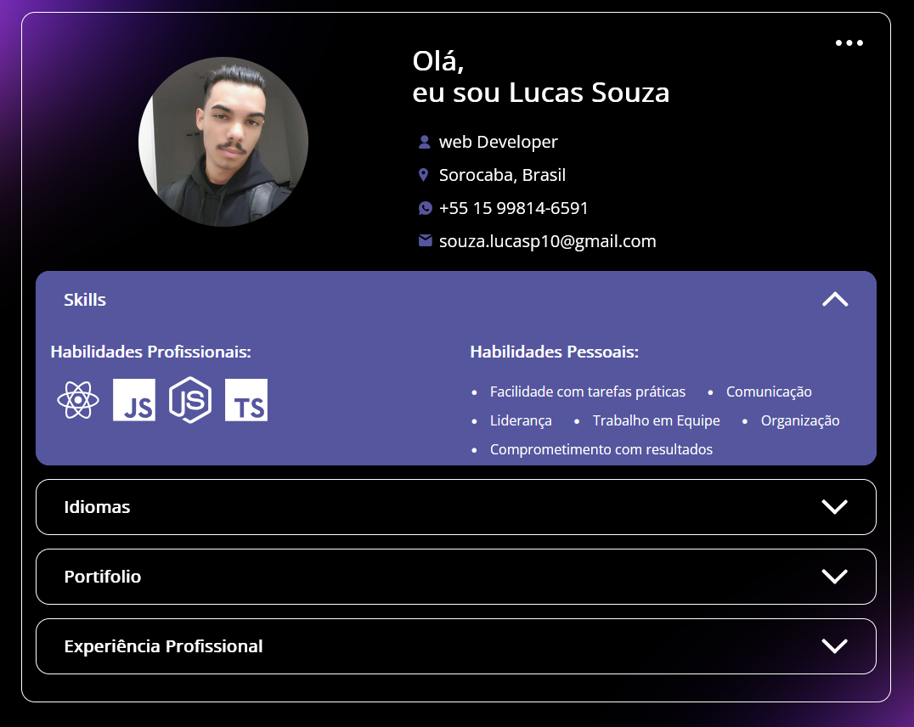

<h1 align="center" style="font-weight: bold;">Portfolio 💻</h1>

<p align="center">
    <b>Bem-vindo ao meu portfólio! Aqui você encontrará alguns dos meus projetos, experiências e habilidades na área de desenvolvimento.</b>
</p>

<p align="center">
     <a href="PROJECT__URL">📱 Visit this Project</a>
</p>

<h2 id="layout">🎨 Layout</h2>

<p align="center">
    
</p>

<h2 id="technologies">💻 Technologies</h2>

- list of all technologies you used
- JavaScript
- HTML
- CSS

<h3>Prerequisites</h3>

- [NodeJS](https://github.com/)
- [Git 2](https://github.com)

<h3>Cloning</h3>

How to clone your project

```bash
git clone SouzaLucas07/Portifolio
```
gh repo clone 

<h3>Starting</h3>

How to start your project

```bash
cd project-name
npm some-command-to-run
```